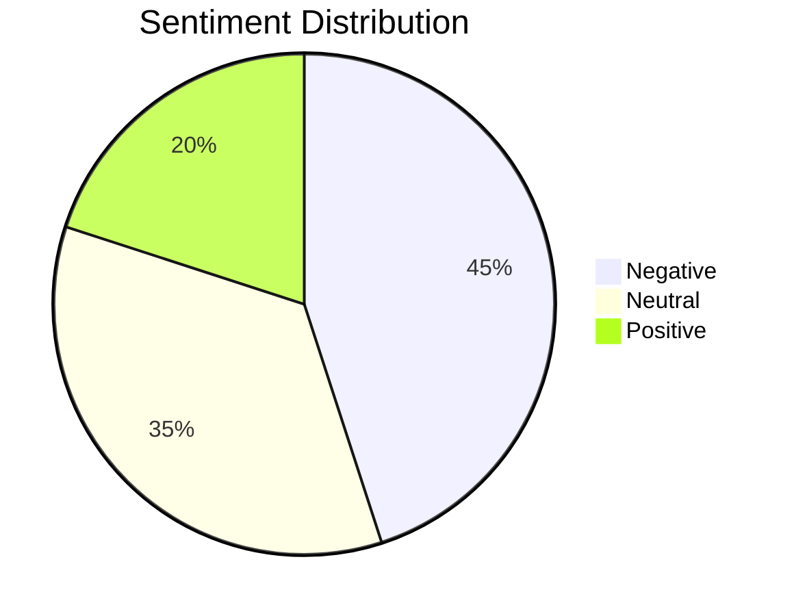
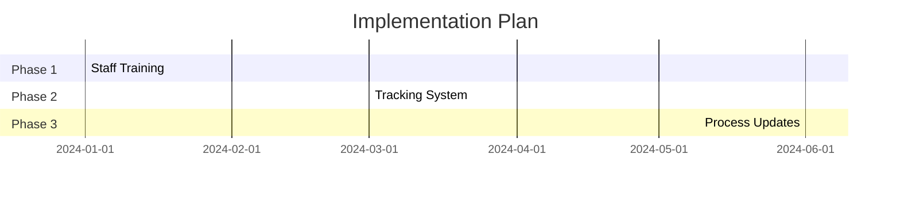

# British_Airways

---
theme: seriph
background: https://source.unsplash.com/collection/94734566/1920x1080
class: 'text-center'
highlighter: shiki
lineNumbers: false
info: |
  British Airways Customer Review Analysis
  Presentation analyzing customer feedback and sentiment.
drawings:
  persist: false
css: unocss
---

# British Airways Customer Review Analysis
Customer Feedback and Sentiment Analysis Report

<div class="pt-12">
  <span @click="$slidev.nav.next" class="px-2 py-1 rounded cursor-pointer" hover="bg-white bg-opacity-10">
    Press Space for next page <carbon:arrow-right class="inline"/>
  </span>
</div>

---
layout: default
---

# Key Sentiment Analysis Findings

<div class="grid grid-cols-2 gap-4">
<div>

## Sentiment Distribution

- 🔴 **45%** Negative
- ⚪ **35%** Neutral
- 🟢 **20%** Positive

</div>
<div>



</div>
</div>

---
layout: two-cols
---

# Common Issues Identified

<v-clicks>

## Primary Concerns
- ⏰ **Flight Delays**
  - Most frequently mentioned issue
  - Major impact on customer satisfaction

- 🧳 **Baggage Handling**
  - Lost luggage reports
  - Delayed baggage retrieval
  
- 👥 **Customer Service**
  - Unresponsive staff
  - Communication challenges

</v-clicks>

::right::

<div class="pl-4 pt-12">

```mermaid {scale: 0.8}
bar
    title Customer Complaints Distribution
    "Flight Delays" 35
    "Baggage Issues" 30
    "Customer Service" 25
    "Other Issues" 10
```

</div>

---
layout: default
---

# Positive Feedback Areas

<div class="grid grid-cols-2 gap-4 mt-4">

<div v-click>

## Entertainment & Comfort
- 🎬 High-quality in-flight entertainment
- 💺 Comfortable seating arrangements
- 🍽️ Satisfactory meal service

</div>

<div v-click>

## Staff Excellence
- 👨‍✈️ Professional flight crew
- 🤝 Helpful ground staff
- 💼 Efficient boarding process

</div>

</div>

<div v-click class="mt-8">

## Notable Customer Comments
> "The in-flight entertainment system was extensive and modern"

> "Cabin crew was professional and attentive throughout the flight"

</div>

---
layout: default
---

# Recommendations

<div class="grid grid-cols-3 gap-4 mt-4">

<div v-click>

## Scheduling
- Optimize flight schedules
- Better delay management
- Improved communication
- Real-time updates

</div>

<div v-click>

## Customer Support
- Enhanced staff training
- Conflict resolution skills
- Response time improvement
- Follow-up protocols

</div>

<div v-click>

## Baggage Handling
- Modern tracking systems
- Staff training
- Process optimization
- Customer communication

</div>

</div>

<div v-click class="mt-12">

## Implementation Timeline



</div>

---
layout: end
class: text-center
---

# Thank You

[Questions & Discussion]
