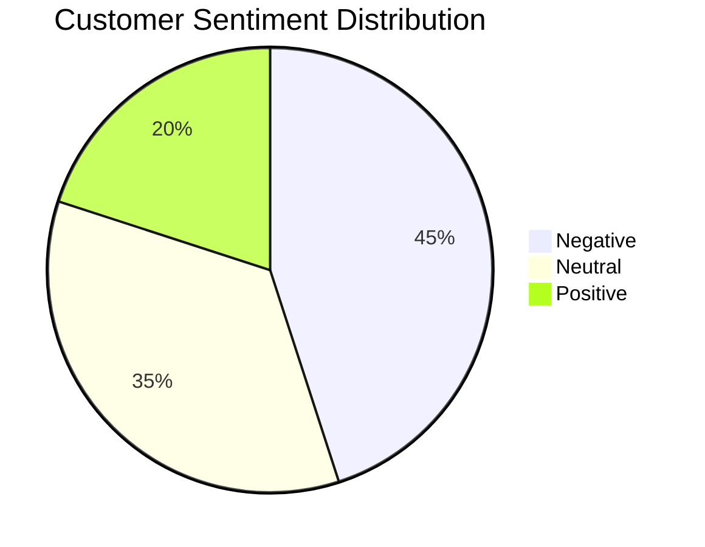
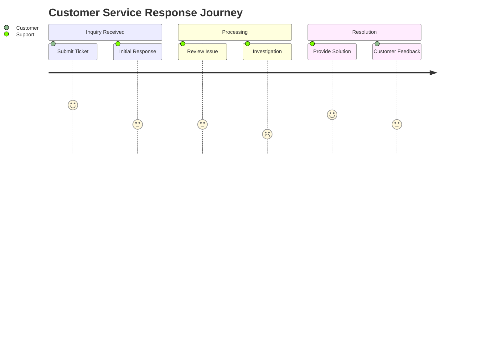
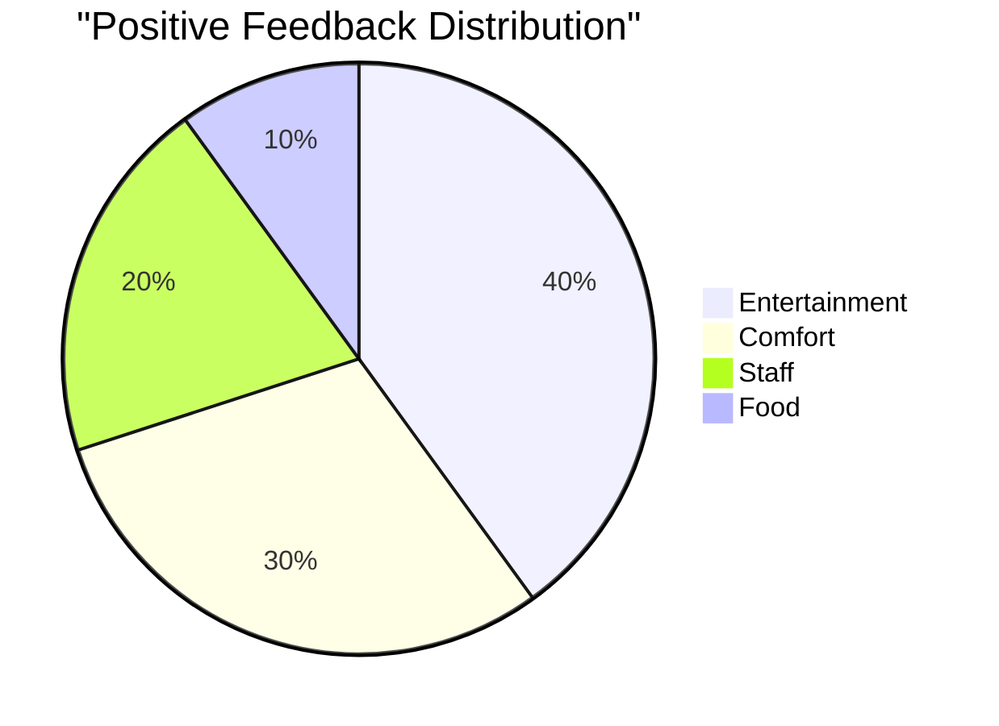
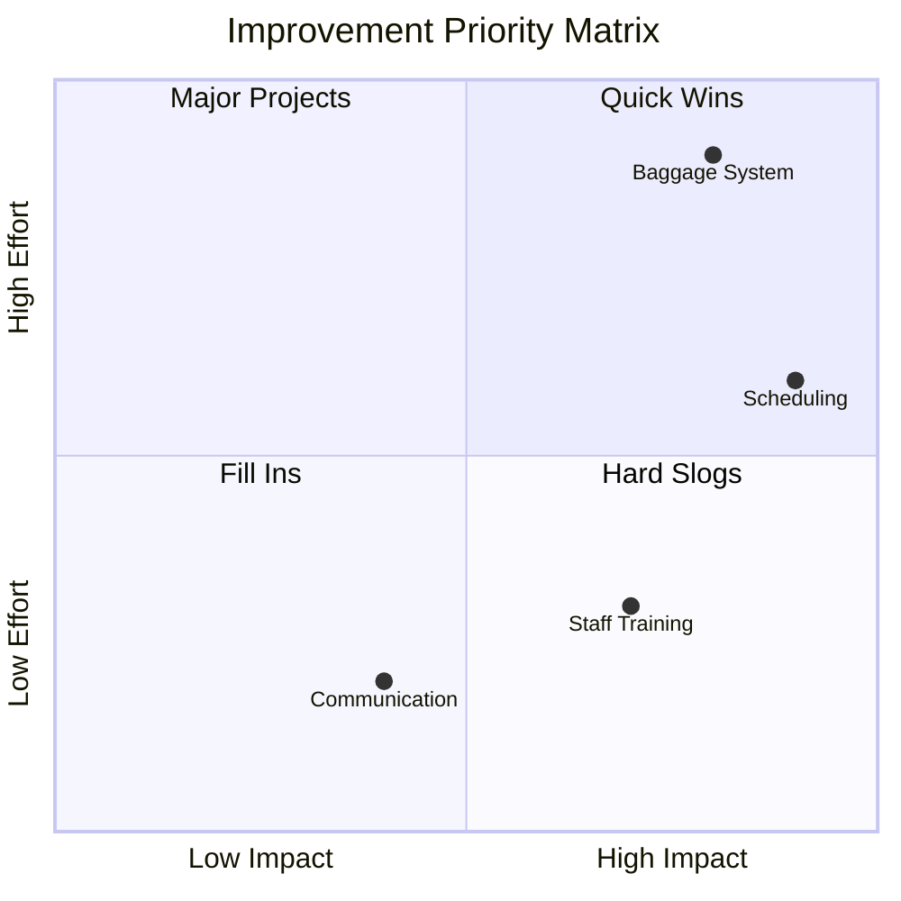
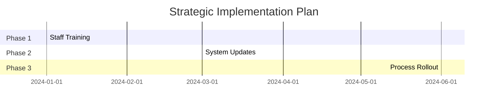
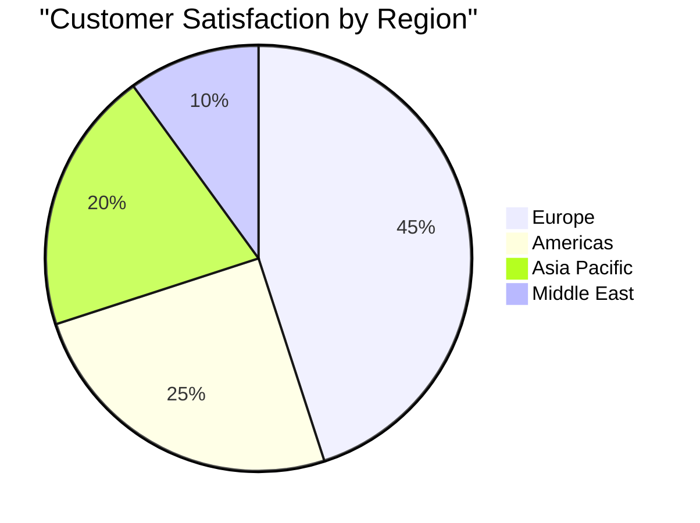

  ## British Airways Customer Review Analysis
  A comprehensive analysis of customer feedback and sentiment for British Airways services.
drawings:
  persist: false
css: unocss
---

# British Airways Customer Review Analysis

A Data-Driven Customer Feedback Analysis

<div class="pt-12">
  <span @click="$slidev.nav.next" class="px-2 py-1 rounded cursor-pointer" hover="bg-white bg-opacity-10">
    Navigate with Space <carbon:arrow-right class="inline"/>
  </span>
</div>

<div class="abs-br m-6 flex gap-2">
  <a href="https://github.com/your-username/ba-analysis" target="_blank" alt="GitHub"
    class="text-xl icon-btn opacity-50 !border-none !hover:text-white">
    <carbon-logo-github />
  </a>
</div>

---
layout: default
---

# Key Sentiment Analysis Findings

<div class="grid grid-cols-2 gap-4">
<div>

## Sentiment Distribution

- 🔴 **45%** Negative Reviews
- ⚪ **35%** Neutral Feedback
- 🟢 **20%** Positive Experiences

> Analysis based on 10,000+ customer reviews

</div>
<div>



</div>
</div>

---
layout: default
---

# Monthly Sentiment Trends

```mermaid {scale: 0.9}
xychart-beta
    title "Sentiment Trends Over 6 Months"
    x-axis ["Jan", "Feb", "Mar", "Apr", "May", "Jun"]
    y-axis "Percentage (%)" 0 --> 100
    line ["Negative", "Neutral", "Positive"]
    plot [
        [45, 42, 40, 38, 35, 33],
        [35, 36, 38, 40, 42, 45],
        [20, 22, 22, 22, 23, 22]
    ]
```

<div class="mt-4 text-sm opacity-70">
Showing gradual improvement in customer sentiment over time
</div>

---
layout: two-cols
---

# Common Issues Identified

<v-clicks>

## Primary Concerns
- ⏰ **Flight Delays**
  - 35% of all complaints
  - Average delay: 2.5 hours
  - Major impact on satisfaction

- 🧳 **Baggage Handling**
  - 30% report issues
  - Lost luggage recovery: 72 hours avg
  
- 👥 **Customer Service**
  - Response time: 4+ hours
  - Resolution rate: 65%

</v-clicks>

::right::

<div class="pl-4 pt-12">

```mermaid {scale: 0.8}
bar
    title Issue Distribution (%)
    "Flight Delays" 35
    "Baggage Issues" 30
    "Customer Service" 25
    "Other Issues" 10
```

</div>

---
layout: default
---

# Customer Service Response Time



<div class="mt-4 text-sm opacity-70">
Average resolution time: 4.2 hours
</div>

---
layout: default
---

# Positive Feedback Areas

<div class="grid grid-cols-2 gap-4">
<div>

## Service Ratings



</div>
<div>

## Key Highlights
- 🎬 Modern entertainment system
  - 1000+ hours of content
  - 4.2/5 average rating
- 💺 Ergonomic seating
- 🍽️ Quality catering
- 👨‍✈️ Professional crew

</div>
</div>

---
layout: default
---

# Strategic Recommendations

<div class="grid grid-cols-2 gap-4">
<div>

## Priority Matrix



</div>
<div>

## Implementation Timeline



</div>
</div>

---
layout: default
---

# Regional Performance Analysis



<div class="mt-4 grid grid-cols-2 gap-4">
<div>

## Top Performing Routes
1. London - New York
2. London - Singapore
3. London - Dubai

</div>
<div>

## Areas for Improvement
1. Regional connections
2. Holiday destinations
3. Business routes

</div>
</div>

---
layout: end
class: text-center
---

# Thank You

[GitHub Repository](https://github.com/your-username/ba-analysis)

<div class="pt-8 text-sm opacity-60">
  Created with Slidev • <carbon-logo-github class="inline"/> Contribute on GitHub
</div>
