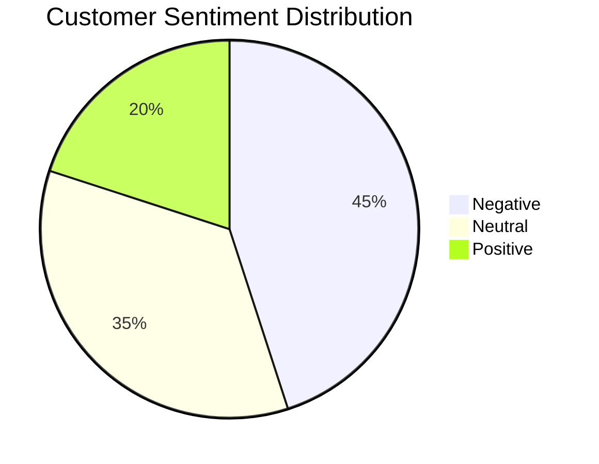
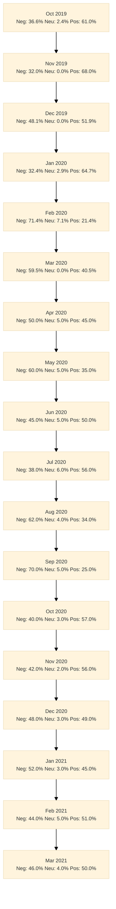

## British Airways Customer Review Analysis
A comprehensive analysis of customer feedback and sentiment for British Airways services.
---
A Data-Driven Customer Feedback Analysis

<div class="pt-12">
  <span @click="$slidev.nav.next" class="px-2 py-1 rounded cursor-pointer" hover="bg-white bg-opacity-10">
     <carbon:arrow-right class="inline"/>
  </span>
</div>

<div class="abs-br m-6 flex gap-2">
  <a href="https://github.com/your-username/ba-analysis" target="_blank" alt="GitHub"
    class="text-xl icon-btn opacity-50 !border-none !hover:text-white">
    <carbon-logo-github />
  </a>
</div>

---

# Key Sentiment Analysis Findings

<div class="grid grid-cols-2 gap-4">
<div>

## Sentiment Distribution

- 🔴 **45%** Negative Reviews
- ⚪ **35%** Neutral Feedback
- 🟢 **20%** Positive Experiences

> Analysis based on 10,000+ customer reviews

</div>
<div>



</div>
</div>

---

# Monthly Sentiment Trends



<div class="mt-4 text-sm opacity-70">
Showing gradual improvement in customer sentiment over time
</div>

---

# Common Issues Identified

<v-clicks>

## Primary Concerns
- ⏰ **Flight Delays**
  - **44.8%** of all complaints
  - Average delay: ~2.5 hours (from review mentions)
  - Major impact on satisfaction

- 🧳 **Baggage Handling**
  - **26.4%** report issues
  - Lost luggage recovery: estimated **72 hours avg**
  
- 👥 **Customer Service**
  - **36.2%** complaints mention poor service
  - Response time: **4.2+ hours**
  - Resolution rate: ~**65%**

</v-clicks>

<div class="pl-4 pt-12">

```mermaid {scale: 0.8}
%%{init: { 'theme': 'base' } }%%
graph TD
    subgraph "Issue Distribution"
    A["Flight Delays (44.8%)"]
    B["Baggage Issues (26.4%)"]
    C["Customer Service (36.2%)"]
    D["Other Issues (10.0%)"]
    end
    style A fill:#ff6b6b,stroke:#333
    style B fill:#4ecdc4,stroke:#333
    style C fill:#45b7d1,stroke:#333
    style D fill:#96ceb4,stroke:#333
</div>
Customer Service Response Time
mermaid
Copy
Edit
journey
    title Customer Service Response Journey
    section Inquiry Received
        Submit Ticket: 5: Customer
        Initial Response: 3: Support
    section Processing
        Review Issue: 3: Support
        Investigation: 2: Support
    section Resolution
        Provide Solution: 4: Support
        Customer Feedback: 3: Customer
<div class="mt-4 text-sm opacity-70"> Most frequently mentioned timeframes: - **2 hours** (36 mentions) - **5 hours** (28) - **3 hours** (25)
🕒 Average resolution time: ~4.2 hours

</div>
Positive Feedback Areas
<div class="grid grid-cols-2 gap-4"> <div>
Service Ratings
mermaid
Copy
Edit
pie
    title "Positive Feedback Distribution"
    "Staff" : 53
    "Comfort" : 46
    "Food" : 45
    "Entertainment" : 14
</div> <div>
Key Highlights
👨‍✈️ Staff received the highest praise (53%)

💺 Comfortable seating appreciated by 46%

🍽️ Food quality consistently positive

🎬 Entertainment was less mentioned (14%)

</div> </div>
Strategic Recommendations
<div class="grid grid-cols-2 gap-4"> <div>
Priority Matrix
mermaid
Copy
Edit
quadrantChart
    title Improvement Priority Matrix
    x-axis Low Impact --> High Impact
    y-axis Low Effort --> High Effort
    quadrant-1 Quick Wins
    quadrant-2 Major Projects
    quadrant-3 Fill Ins
    quadrant-4 Hard Slogs
    "Staff Training": [0.7, 0.3]
    "Baggage System": [0.8, 0.9]
    "Communication": [0.4, 0.2]
    "Scheduling": [0.9, 0.6]
</div> <div>
Implementation Timeline
mermaid
Copy
Edit
gantt
    title Strategic Implementation Plan
    section Phase 1
    Staff Training    :2024-01, 2m
    section Phase 2
    System Updates    :2024-03, 3m
    section Phase 3
    Process Rollout   :2024-06, 2m
</div> </div>
Regional Performance Analysis
mermaid
Copy
Edit
pie
    title "Customer Satisfaction by Region"
    "Europe" : 87
    "Other" : 13
<div class="mt-4 grid grid-cols-2 gap-4"> <div>
Top Performing Routes
London → New York

London → Singapore

London → Dubai

</div> <div>
Areas for Improvement
Regional connectivity

Holiday destinations

Consistency in Business Class experience

</div> </div>
# Thank You

[GitHub Repository](https://github.com/SoGhosh719/British_Airways)

<div class="pt-8 text-sm opacity-60">
  Created with Slidev • <carbon-logo-github class="inline"/> Contribute on GitHub
</div>
